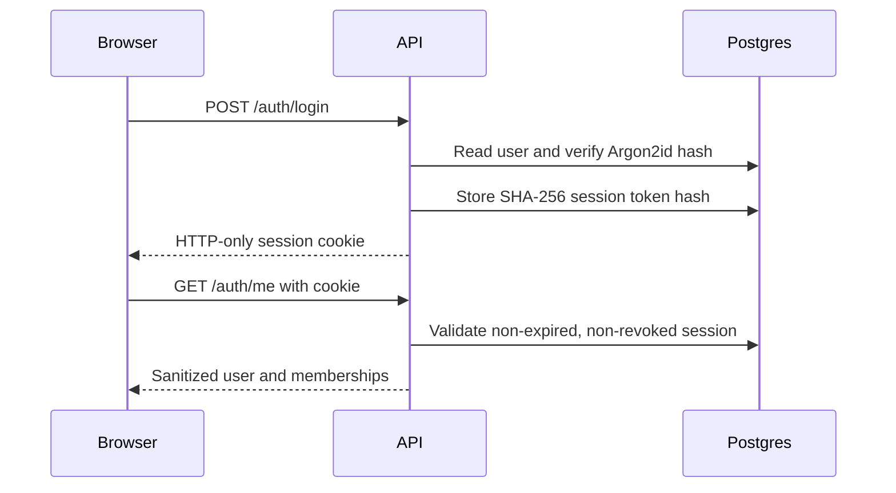
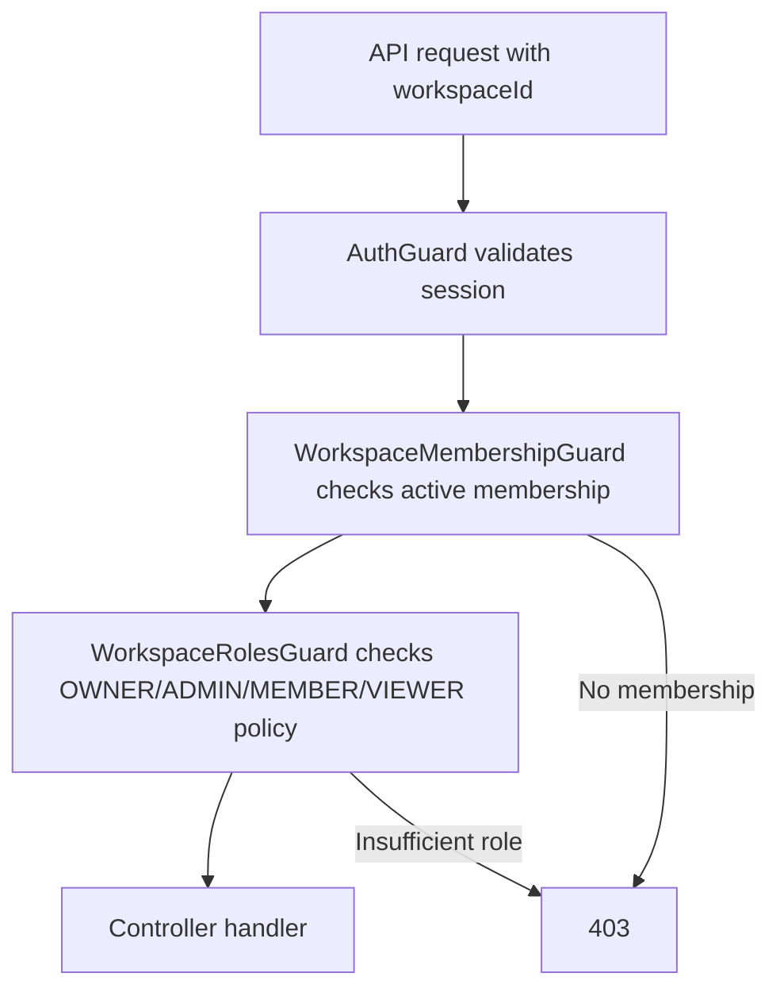
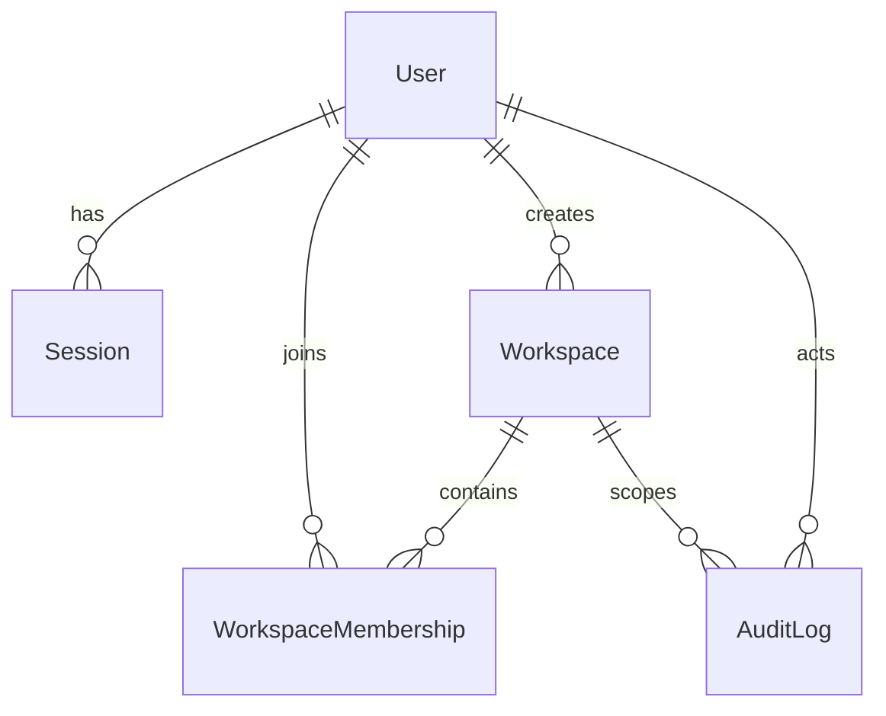

# Auth And Tenancy

## Session Flow

## Workspace Authorization Flow

## Data Relationships

Sessions persist the active workspace selection. All workspace endpoints verify active membership server-side and never trust a client-supplied workspace ID alone.
