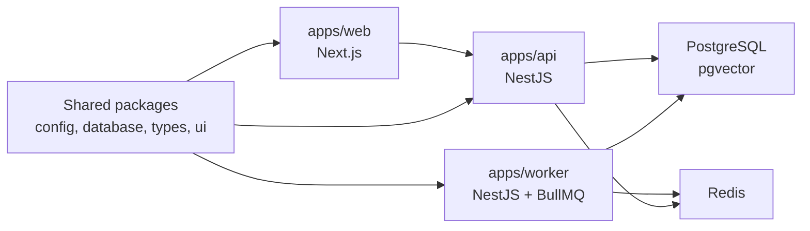

# Bootstrap Architecture

```mermaid
flowchart LR
  Web["apps/web<br/>Next.js"] --> Api["apps/api<br/>NestJS"]
  Api --> Postgres["PostgreSQL<br/>pgvector"]
  Worker["apps/worker<br/>NestJS + BullMQ"] --> Redis["Redis"]
  Worker --> Postgres
  Api --> Redis
  Packages["Shared packages<br/>config, database, types, ui"] --> Web
  Packages --> Api
  Packages --> Worker
```

The bootstrap separates user-facing web, HTTP API, background worker, shared packages, and infrastructure. Domain modules are intentionally not implemented in Sprint 0.
